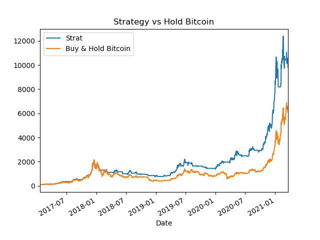

# algorithmic-trading
Backtesting of trading strategies

-AlgoMACrossover.py : vectorized backtesting of a moving average crossover strategy (with 10 and 20 days moving averages).  
Backtesting results :

